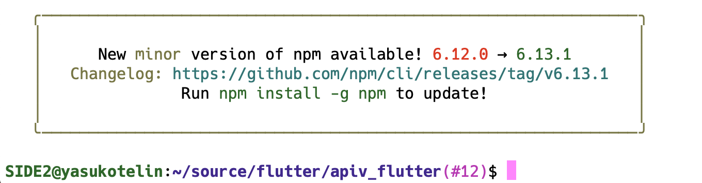
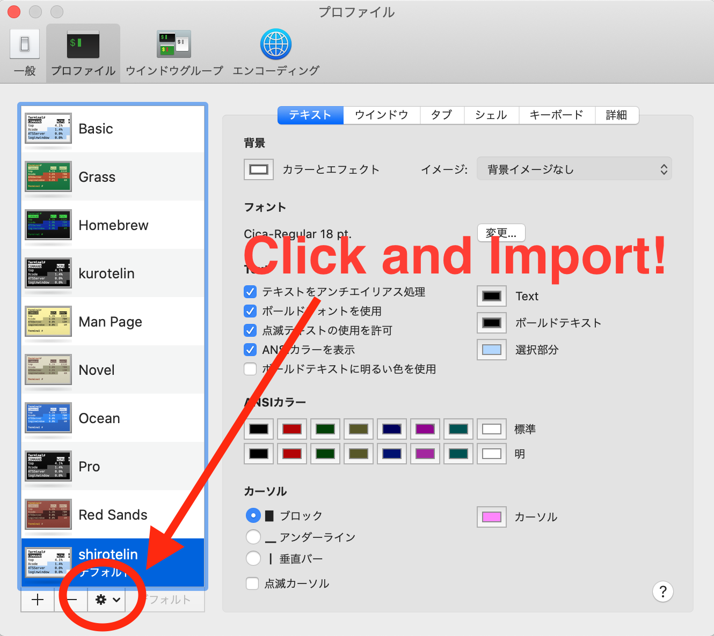

<h1 align="center">🎉 shirotelin for Terminal.app 🎉</h1>

---

This is Light color profile for Terminal.app of MacOS!

shirotelin is Ultimate standart Light color scheme for Vim, IntelliJ and Visual Studio Code and This!

## Install

1. Download `shirotelin.terminal` from [Release page](https://github.com/yasukotelin/shirotelin-terminal-app).
2. Terminal.app > Preference > Profile > Import

## shirotelin family

- for Vim [shirotelin](https://github.com/yasukotelin/shirotelin)
- for JetBrains [shirotelin-intellij](https://github.com/yasukotelin/shirotelin-intellij)
- for Visual Studio Code [shirotelin-vscode](https://github.com/yasukotelin/shirotelin-vscode)

## Author

yasukotelin
